# Simple Node.js Facebook Messenger API #

[](https://www.bithound.io/github/perusworld/node-facebook-messenger-api)
[](https://www.bithound.io/github/perusworld/node-facebook-messenger-api/master/dependencies/npm)
[](https://www.bithound.io/github/perusworld/node-facebook-messenger-api)

Based on the [Messenger Platform Sample](https://github.com/fbsamples/messenger-platform-samples)

## Install ##
```bash
npm install github:perusworld/node-facebook-messenger-api --save
```


## Usage ##
See [Setup](https://developers.facebook.com/docs/messenger-platform/guides/setup) for more details about setting up the bot/page.

### Get User Profile - [User Profile API](https://developers.facebook.com/docs/messenger-platform/user-profile) ##
```javascript
var messengerapi = require('node-facebook-messenger-api').messenger();
var messenger = new messengerapi.Messenger({
    appId:"",
    pageId: "",
    analyticsLogLevel: "",
    appSecret: "",
    pageAccessToken: "",
    validationToken: ""
});

var pageScopedUserID = "...";

messenger.getUserProfile(pageScopedUserID, (err, resp) => {
    if (err) {
        console.error(recipientId, "Sorry, looks like the backend is down :-(");
    } else {
        console.log(JSON.parse(resp));
    }
});
```

### Send Generic Template Message - [Generic Template](https://developers.facebook.com/docs/messenger-platform/send-api-reference/generic-template) ###
```javascript
messenger.sendGenericMessage(pageScopeUserID, [{
    title: "Welcome to Peter\'s Hats",
    image_url: "https://petersfancybrownhats.com/company_image.png",
    subtitle: "We\'ve got the right hat for everyone.",
    default_action: {
        type: "web_url",
        url: "https://peterssendreceiveapp.ngrok.io/view?item=103",
        messenger_extensions: true,
        webview_height_ratio: "tall",
        fallback_url: "https://peterssendreceiveapp.ngrok.io/"
    },
    buttons: [{
        type: "web_url",
        url: "https://petersfancybrownhats.com",
        title: "View Website"
    }, {
        type: "postback",
        title: "Start Chatting",
        payload: "DEVELOPER_DEFINED_PAYLOAD"
    }]
}]);
```

### Using Webhook Handler to receive Facebook Messenger Events - [Webhook Reference](https://developers.facebook.com/docs/messenger-platform/webhook-reference) ###
The example folder contains a sample app 
```bash
npm install
cd example
export MESSENGER_ANALYTICS_LOG_LEVEL = "2";
export MESSENGER_APP_ID = "--yours--";
export MESSENGER_PAGE_ID = "--yours--";
export MESSENGER_APP_SECRET="--yours--"
export MESSENGER_VALIDATION_TOKEN="--yours--"
export MESSENGER_PAGE_ACCESS_TOKEN="--yours--"
node server
```
Or use this in your existing code
```javascript
const
  express = require('express');

var ignores = ['/some-url/to-ignore'];
var verifySignature = true;

var messengerapi = require('node-facebook-messenger-api').messenger();
var messenger = new messengerapi.Messenger({});
var webhookHandler = require('node-facebook-messenger-api').webhookHandler()(messenger, {
  receivedAuthentication : function(event) {
    console.log('receivedAuthentication', event);
  },
  handleMessage : function(event) {
    console.log('handleMessage', event);
    messenger.sendTextMessage(event.sender.id, JSON.stringify(event));
  },
  receivedDeliveryConfirmation : function(event) {
    console.log('receivedDeliveryConfirmation', event);
  },
  receivedPostback : function(event) {
    console.log('receivedPostback', event);
  },
  receivedMessageRead : function(event) {
    console.log('receivedMessageRead', event);
  },
  doLinking : function(event) {
    console.log('doLinking', event);
  },
  doUnlinking : function(event) {
    console.log('doUnlinking', event);
  }
},verifySignature, ignores, express.Router());

var app = express();
app.set('port', process.env.PORT || 3000);
app.use(express.static('public'));

app.use('/fb', webhookHandler);
app.listen(app.get('port'), function () {
  console.log('Node app is running in http mode on port', app.get('port'));
});
```
#### Analytics Events ####
You can now send analytics events through the following API (See [App Events with Bots for Messenger - Logging Custom Events](https://developers.facebook.com/docs/app-events/bots-for-messenger#logging-custom-events) and [App Events API](https://developers.facebook.com/docs/marketing-api/app-event-api/v2.9) for more details about the event types)

For performace reasons if you would like to throttle the events that you would like to send/track, you can use the env variable
```bash
export MESSENGER_ANALYTICS_LOG_LEVEL = "2";
```
to control the log levels. Set that to 

Level | Value | Description |
--- | --- | --- |
None | 99 | Don't send any analytics events |
Critical | 2 | Send only critical analytics events |
Verbose | 1 | Send all analytics events |

The asynchronous callback from the *analyticsEvent* call would be either 
```json
{
  "success": true
}
```
if the event was successfully accepted or
```json
{
  "skip": true
}
```
if the event was skipped due lower log levels

 - Custom Event
```javascript
  messenger.analyticsEvent(messengerapi.ANALYTICS_LEVEL_VERBOSE, event.sender.id, () => {
    return messenger.buildAnalyticsEvent("fb_mobile_verbose_event");
  }, (err, resp) => {
    messenger.sendTextMessage(event.sender.id, JSON.stringify(err ? err : resp));
  });
```

 - Standard Purchase Event
```javascript
  messenger.analyticsEvent(messengerapi.ANALYTICS_LEVEL_CRITICAL, event.sender.id, () => {
    return messenger.buildAnalyticsEvent("fb_mobile_purchase", { _valueToSum: 9.99, fb_currency: 'USD' });
  }, (err, resp) => {
    messenger.sendTextMessage(event.sender.id, JSON.stringify(err ? err : resp));
  });
```
 - Standard Add Cart Event Using quickAnalytics
```javascript
  messenger.quickAnalytics(messengerapi.ANALYTICS_LEVEL_CRITICAL, event.sender.id, "fb_mobile_add_to_cart", {
    fb_content_type: 'blah blah blah', fb_content_id: '123456789', _valueToSum: 9.99, fb_currency: 'USD'
  });
```

## Write a facebook messenger bot and host it on heroku ##
Follow the steps mentioned below to quickly deploy an echo facebook bot on heroku. This assumes that you have setup your [heroku cli](https://devcenter.heroku.com/articles/heroku-cli).

1. Code to handle the messages that the users send and to reply back

 - Create a nodejs app and add the required dependencies.
```bash
mkdir myfb-bot
cd myfb-bot
npm init -y
npm install express body-parser github:perusworld/node-facebook-messenger-api --save
```
 - Add the code to handle messages from the users. Create a file named server.js and add the following as its content
```javascript
const
  express = require('express');

var ignores = ['/some-url/to-ignore'];
var verifySignature = true;

var messengerapi = require('node-facebook-messenger-api').messenger();
var messenger = new messengerapi.Messenger({});
var webhookHandler = require('node-facebook-messenger-api').webhookHandler()(messenger, {
  receivedAuthentication : function(event) {
    console.log('receivedAuthentication', event);
  },
  handleMessage : function(event) {
    console.log('handleMessage', event);
    messenger.sendTextMessage(event.sender.id, JSON.stringify(event));
  },
  receivedDeliveryConfirmation : function(event) {
    console.log('receivedDeliveryConfirmation', event);
  },
  receivedPostback : function(event) {
    console.log('receivedPostback', event);
  },
  receivedMessageRead : function(event) {
    console.log('receivedMessageRead', event);
  },
  doLinking : function(event) {
    console.log('doLinking', event);
  },
  doUnlinking : function(event) {
    console.log('doUnlinking', event);
  }
},verifySignature, ignores, express.Router());

var app = express();
app.set('port', process.env.PORT || 3000);
app.use(express.static('public'));

app.use('/fb', webhookHandler);
app.listen(app.get('port'), function () {
  console.log('Node app is running in http mode on port', app.get('port'));
});
```
 - Edit the package.json file and add the following to the scripts section of the json block
 ```json
    "start": "node server.js",
 ```
 it should look something like this
 ```json
  "scripts": {
    "start": "node server.js",
    "test": "echo \"Error: no test specified\" && exit 1"
  },
 ```
2. A facebook page that users can find and start the conversation.

 - Create a facebook page by going to the following url (https://www.facebook.com/pages/create/), follow the steps mentioned there.
 - Once you have created the facebook page, go to the "About" section of the newly created page and copy the page id (a 16 digit number)
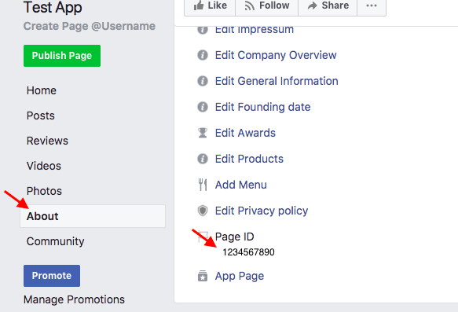

3. A facebook app that links the above two

 - Create a facebook app by going to the following url (https://developers.facebook.com/apps/).
 - Once you have created the facebook app, go to its dashboard page and copy the app id and the app secret values.
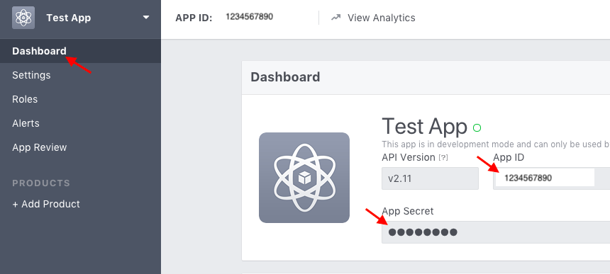
 - Click on add product and choose messenger setup
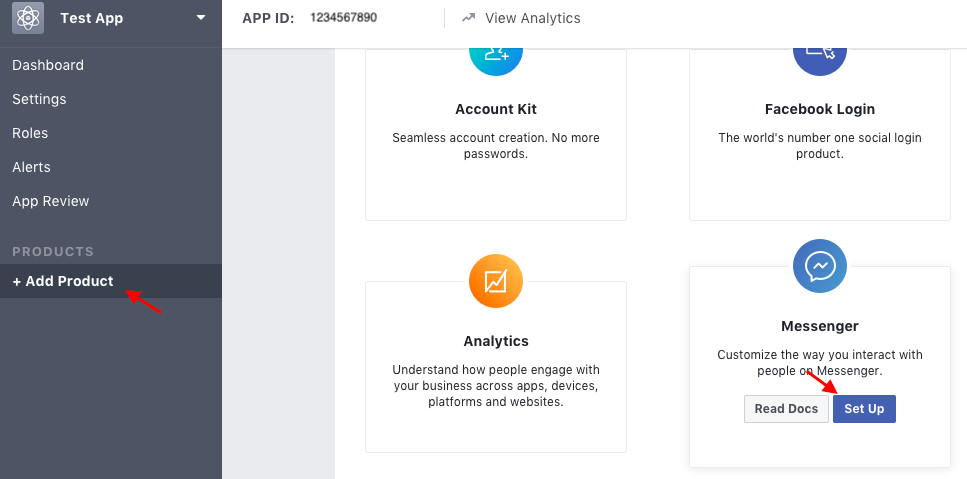
 - From the token generation section, select the page that you just created above from the drop down and copy the generated page access token value
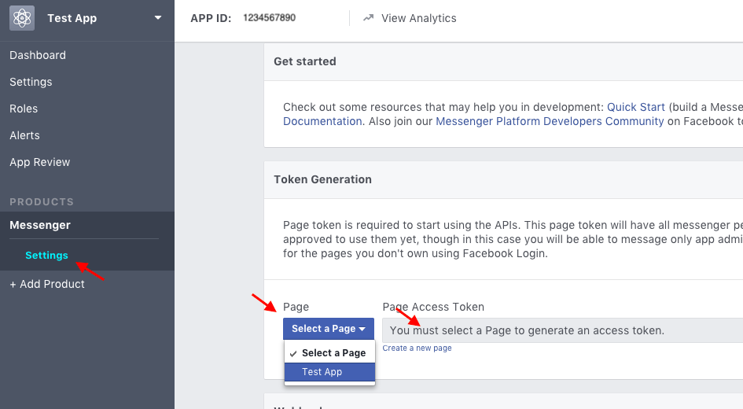

4. Setup and deploy to heroku

 -  Now we have enough information to deploy to heroku. If you haven't initialized git for this project do so now by running the following command from the myfb-bot folder
 ```bash
git init
echo node_modules  >> .gitignore
git add .
git commit -m 'initial'
 ```
 -  Run the following to create a heroku app
 ```bash
heroku create
 ```
 - Once the app has been created copy the first of the two urls outputted.
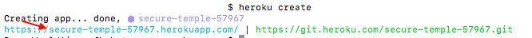

 - Run the following commands, replacing the placeholders with the values you have copied
 ```bash
 heroku config:set MESSENGER_APP_ID="--your-app-id--"
 heroku config:set MESSENGER_PAGE_ID="--your-page-id--"
 heroku config:set MESSENGER_APP_SECRET="--your-app-secret--"
 heroku config:set MESSENGER_PAGE_ACCESS_TOKEN="--your-page-access-token--"
 heroku config:set MESSENGER_VALIDATION_TOKEN="--your-validation-token-some-string-that-you-should-keep-secret--"
 ```

 - Push the code to heroku.
 ```bash
git push heroku master
 ```

- Once the deployment completes successfully, lets go back to facebook and finish the setup process. Got to https://developers.facebook.com/apps and select the app that you have just created and select Messenger and then Setup Webhooks
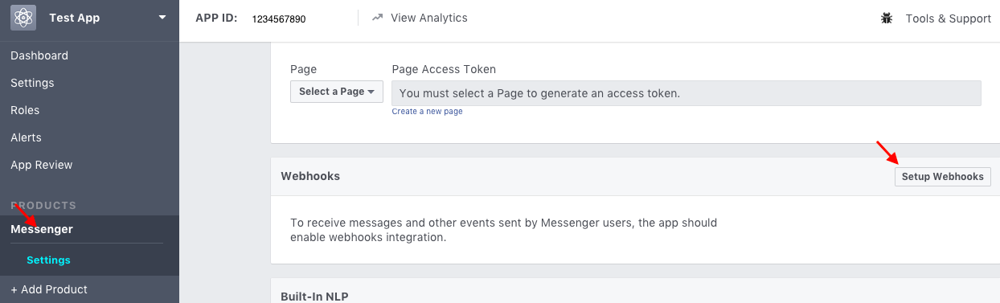
 - On the config page use the first url you had copied above suffixed with /fb/webhook
 - Use the value you had used for the MESSENGER_PAGE_ACCESS_TOKEN config above as the verify token
 - select messages, messaging_postbacks and messagin_account_linking and click verify and save
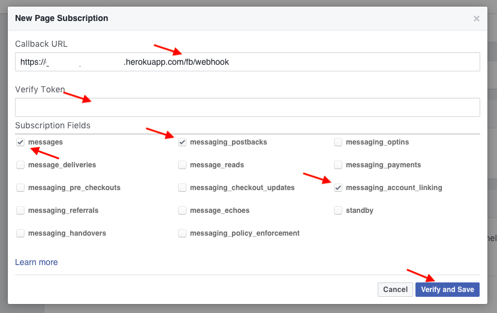
 - After successful verification, webhook config should be complete and now we need to subscribe the app to the facebook page for event, select the page that you just created from the dropdown and click subscribe
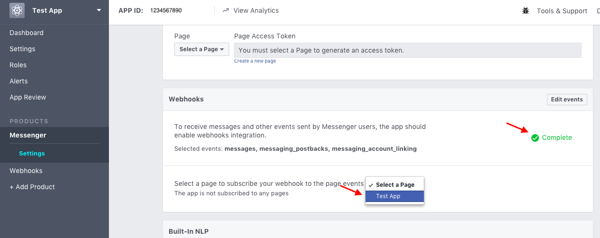
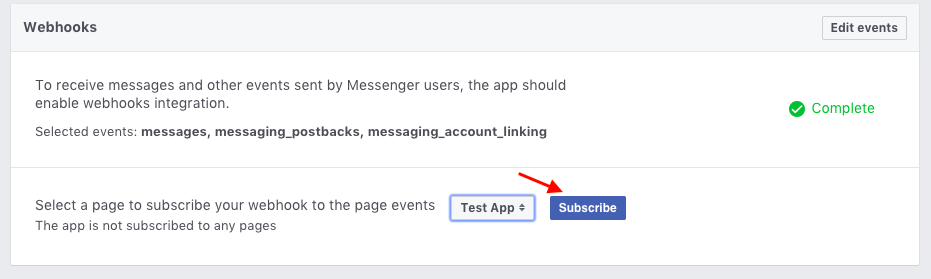
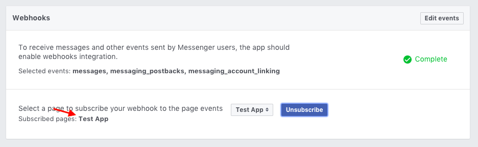
 - Now everything is setup and we just need to test it. Go to the facebook page that you just created, go to the about page, click on send message. It should open a chat window, type hi or any message and it should echo back the raw message
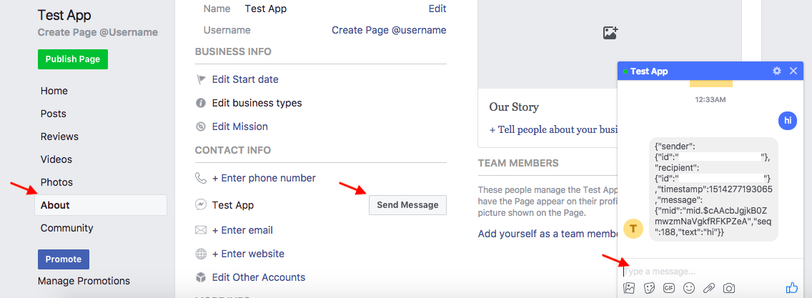
 - Now you can modify the necessary methods in server.js to handle your use-case.